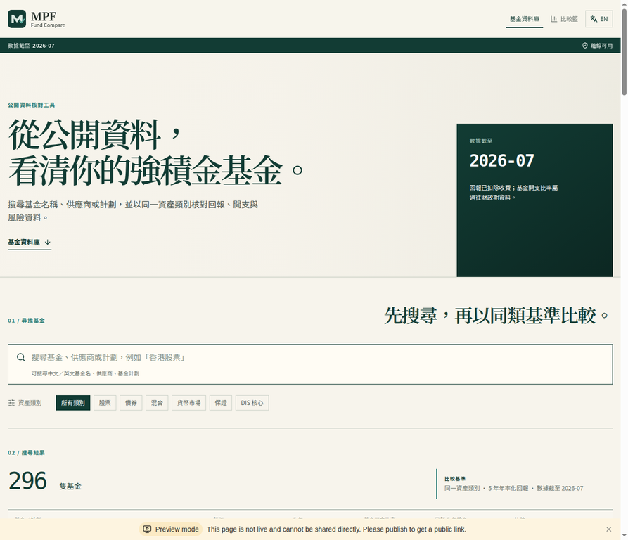
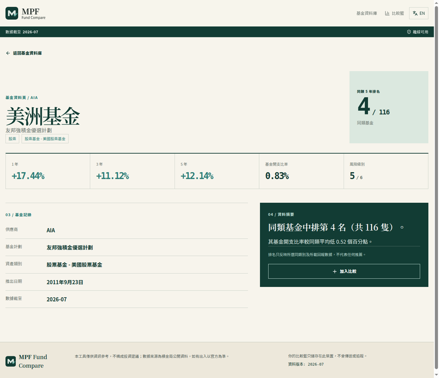
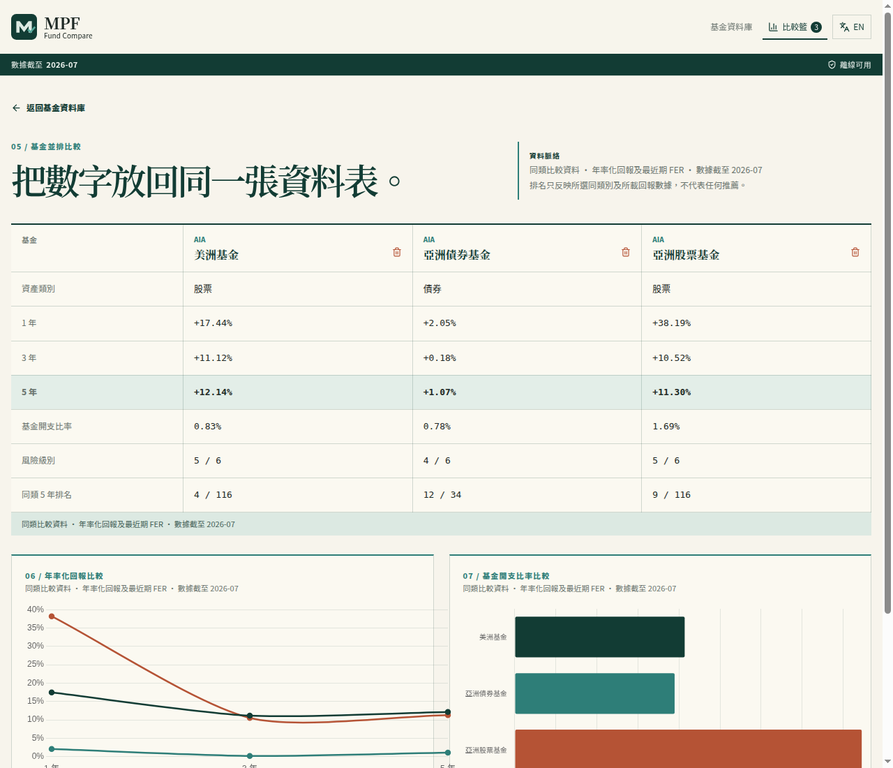
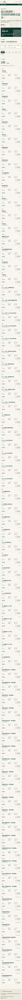

# MPF Fund Compare｜強積金基金比較器

> **公開資料核對工具**：以積金局強積金基金平台的公開資料，協助香港打工仔在同一資產類別內比較回報、基金開支比率（FER）及風險級別。它不是投資建議，也不會推薦任何基金。



## 功能與設計原則

本專案是一個可安裝、離線可用的純前端 PWA。所有基金資料打包在 `data/funds.json`，瀏覽、搜尋與比較均在使用者瀏覽器內完成；比較籃只以 `localStorage` 儲存在本機，沒有後端、資料庫、帳戶、cookie 追蹤或分析程式碼。

| 範圍 | 實作方式 |
| --- | --- |
| 搜尋與篩選 | 中英文基金名稱、供應商、基金計劃；股票、債券、混合、貨幣市場、保證及 DIS 核心分類，可按積金局基金資訊表的中英文**基金細分類**縮窄結果，並以網址分享篩選條件。 |
| 基金資料頁 | 1 年／3 年／5 年年率化回報、FER、風險級別、推出日期與同類 5 年排名。 |
| 同類比較 | 以相同資產大類的 5 年年率化回報排序；資料摘要只描述名次與相對 FER，不作推薦。 |
| 比較與匯出 | 選取最多 3 隻基金，顯示指標表、Chart.js 回報曲線與 FER 長條圖；可切換資產類別／細分類同儕基準，下載 CSV 或列印含資料月份、比較表與免責聲明的比較摘要，亦支援 `?funds=mpfa-878,mpfa-875` 分享網址。 |
| 新手傻瓜包 | 繁中／English 的 6 步閱讀路線，說明如何核對計劃、比較同類基金、閱讀回報／FER／風險、查閱 KSID 與基金便覽，以及認識 DIS 的非保本性質；不提供個別基金推薦。[2] [3] [4] |
| 術語與常見問題 | 雙語小詞典解釋年率化回報、FER、風險級別、同類排名、基金便覽、DIS 與資料月份；常見問題明確說明單一欄目不等於推薦。[1] [3] [4] |
| 資料透明度 | 首頁與新手頁列出資料月份、雙語基金記錄數、最新基線快照及每月核對流程連結；「資料版本紀錄」頁保留資料發布、差異摘要與 PR 審核脈絡，清楚區分資料快照與即時報價。 |
| 語言與裝置 | 繁體中文及 English 切換；手機優先的響應式布局。 |
| PWA | Web manifest、離線 service worker、可安裝圖示及無網絡時的已快取資料。 |

基金結果可按名稱、5 年回報、FER 或同類排名排序。CSV 匯出會加入 UTF-8 BOM 以利常見試算表讀取繁中，並會中和可能被試算表解讀為公式的欄位字首。

### 資料頁與比較頁

| 基金資料頁 | 基金並排比較 |
| --- | --- |
|  |  |



## 資料、範圍與免責聲明

目前種子資料包含 **296 隻**具完整中英文名稱、風險級別、1／3／5 年回報及 FER 的基金資料列；資料版本為 **2026-07**。資料由積金局強積金基金平台「基金資訊表」的中英文公開列手動匯出、按基金識別碼配對及正規化而來。[1]

> **免責聲明｜Disclaimer**：本工具僅供資訊參考，不構成投資建議；數據來源為積金局公開資料，如有出入以官方為準。This tool is for information only and does not constitute investment advice. Data is based on public MPFA information; official information prevails in case of discrepancy.

回報欄位使用平台所列的年率化回報；FER 是平台列示的最近期基金開支比率，未必與回報的時間範圍相同。強積金基金表現平台亦提醒使用者同類別基金方可作可比比較，過往表現不代表未來表現。[1] 本專案因此只使用「排名／比較」表述，沒有「買入」、「最佳」或任何推薦性內容。

### 資料 schema

`data/funds.json` 的頂層包含 schema 版本、資料截至月份、來源描述及 `funds` 陣列。每一列基金均使用下列穩定欄位：

| 欄位 | 描述 |
| --- | --- |
| `fund_id`、`source_fund_id` | 專案及積金局基金識別碼。 |
| `name`、`scheme`、`trustee` | `{ "zh-Hant", "en" }` 的中英對照資料。 |
| `provider`、`asset_class`、`asset_category` | 基金供應商及正規化／原始資產類別。 |
| `risk_level` | 積金局平台所列風險級別（1–6）。 |
| `returns` | `one_year`、`three_year`、`five_year` 年率化回報（百分比數值）。 |
| `fer`、`inception_date`、`as_of` | 最近期基金開支比率、推出日期及資料月份。 |
| `source` | 對應的積金局公開資料頁網址。 |

## 開發

本專案使用 Vite + React + TypeScript，沒有執行時後端。需要 Node.js 22 及 pnpm 10。

```bash
git clone https://github.com/<your-account>/mpf-fund-compare.git
cd mpf-fund-compare
pnpm install --frozen-lockfile
pnpm dev
```

| 指令 | 用途 |
| --- | --- |
| `pnpm dev` | 啟動本機開發伺服器。 |
| `pnpm run lint` | 執行 TypeScript 型別檢查。 |
| `pnpm test` | 驗證 `funds.json` 的欄位、雙語資料、數值範圍與唯一識別碼。 |
| `pnpm run test:e2e` | 使用 Playwright／Chromium 驗證新手教學、術語與資料版本頁、基金搜尋與分享、比較籃及列印摘要的瀏覽器流程。首次執行前請執行 `pnpm exec playwright install chromium`。 |
| `pnpm run test:all` | 依序執行資料／工具單元測試及端對端測試。 |
| `pnpm run build` | 產生可部署的純靜態網站至 `dist/public`。 |

## 更新基金資料

資料**不是即時**資料，亦不會自動從積金局網站抓取。更新者應在積金局基金資訊表選取所需基金／計劃，分別匯出繁體中文與英文資料列，保留基金識別碼，再用 `scripts/update_data.py` 合併為一致 schema。[1]

```bash
python3 scripts/update_data.py \
  --tch raw/mpfa-tch.json \
  --eng raw/mpfa-eng.json \
  --output data/funds.json \
  --as-of 2026-08

cp data/funds.json client/public/data/funds.json
pnpm test
```

轉換器刻意不發出網絡請求，避免把一次性的公開資料快照誤稱為實時數據。提交更新前，請確認資料月份、官方欄位次序及 `pnpm test` 均通過。

每月維護應保留人手核對步驟：先檢查官方資料截至月份與中英文列是否匹配，再轉換、測試、檢視差異和提交。不要把這個流程描述為自動或實時更新。完整核對順序見 [`docs/monthly-update-checklist.md`](docs/monthly-update-checklist.md)；`scripts/describe_data_change.py` 可產生新增、移除與變更基金的摘要，供 Pull Request 審核。每次資料更新亦應新增 `docs/data-changelog/YYYY-MM.md` 並在 PR 連結，讓網站「資料版本紀錄」與 repository 審核資料維持一致。

## GitHub Pages 部署

所有改動應透過 Pull Request 合併至受保護的 `main`。`.github/workflows/ci.yml` 的 `validate` 工作會執行 lint、資料 schema 測試、靜態建置及 Playwright Chromium 端對端測試；`.github/workflows/deploy-pages.yml` 則把 `dist/public` 部署至 GitHub Pages。首次使用時，請在 repository **Settings → Pages** 將 Source 設為 **GitHub Actions**。

Vite 的 GitHub Actions 建置基底已設為 `/mpf-fund-compare/`。如 fork 後改名，請同步修改 `vite.config.ts` 的 `base` 值，確保靜態資產和 PWA 深連結能正確定位。

## 貢獻

歡迎提交資料校正、無障礙改善、測試或翻譯。請勿加入基金推薦、未經核實的回報資料、偽造用戶評論或任何會追蹤使用者的程式。提交 Pull Request 前請執行 `pnpm run lint && pnpm test && pnpm run build`，並在資料更新中列出官方資料截至月份與來源。詳細標準見 [CONTRIBUTING.md](CONTRIBUTING.md)、[CODE_OF_CONDUCT.md](CODE_OF_CONDUCT.md) 及 [SECURITY.md](SECURITY.md)。

## License

本專案以 [MIT License](LICENSE) 發布。

## References

[1]: https://mfp.mpfa.org.hk/mobile/tch/mpp_list.jsp "積金局強積金基金平台：基金資訊表"
[2]: https://www.mpfa.org.hk/en/info-centre/publications-articles/mpfa-articles/2024_9_25 "MPFA: Made-easy guide book for the MPF"
[3]: https://www.ifec.org.hk/web/tc/young-adults/youth-investment/5-steps-mpf-funds.page "投委會：揀選強積金基金 5 個步驟"
[4]: https://www.mpfa.org.hk/en/mpf-investment/portfolio/default-investment-strategy "MPFA: Default Investment Strategy"
